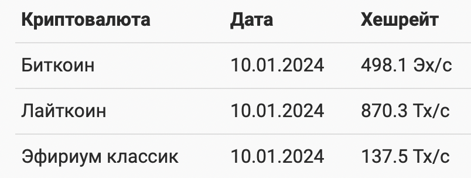
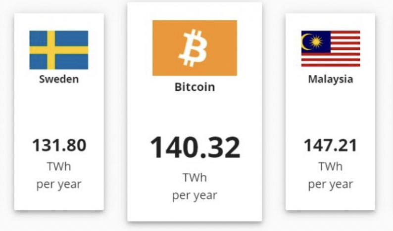
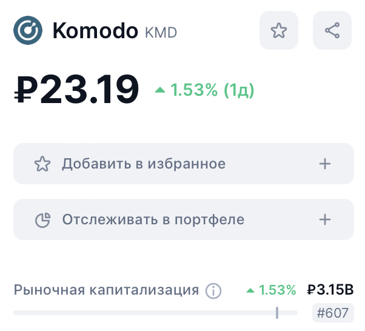
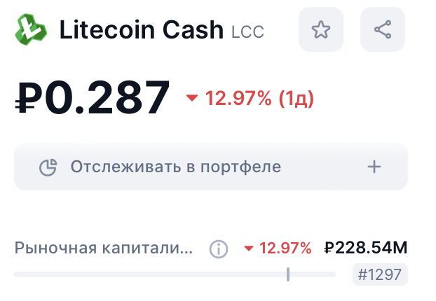

# Почему delayed-proof-of-work безопаснее proof-of-work? Экономит ли hive-mining ваши ресурсы?

## Введение
Криптовалюта стала прорывной идеей 21 века и заинтересовала большое количество людей. Кто-то повелся на сомнительные NFT, кто-то воспользовался принципом анонимности и стал расплачиваться ей за незаконные услуги, кто-то, как и автор, просто нашел в ней перспективу и стал инвестировать в нее.
В 2015 году, когда биткоин стоил уже почти 500 долларов, криптовалютой заинтересовались мошенники и уже в 2016 году была совершена первая известная в истории атака 51% на монеты Krypton и Shift
Этот инциндент сделал криптовалюту уязвимой и эта атака стала главным страхом криптоинвесторов. В этой статье мы рассмотрим эффективность 2 способов защиты: DPoW и hive-mining.

## Небольшая информационная справка для понимая
- **Блок** - информация об определенном количестве транзакций с заголовком. В заголовке свой хеш и хеш соседа.
- **Консенсус** - механизм для координации действий участников в распределенной(децентрализованной) сети.
- **Атака 51%** - когда группа лиц владеет более 50 процентов мощностей сети, она сможет обойти механизм консенсуса и совершить двойную трату одного и то же актива.
- **Proof-of-work(PoW)** - алгоритм консенсуса использующий хеш-функции:
Протокол устанавливает специальные условия для успешной валидации блока, например хеш блока начинается с 11, и майнеру необходимо гадать(перебирать) данные для получения вознаграждения.
- **Отвергнутые блоки** - из-за ограничения ретрансляции информации могут возникнуть два блока с одним родителем, что считается недопустимым, поэтому после выявления этой проблемы сообщество выбирает главную ветвь и отвергает все блоки из другой цепи. Все транзакции в таких блоках становятся недействительными и отменяются(монеты возвращаются на изначальный баланс).
- **Сложность майнинга** - определяет насколько тяжело подобрать необходимый хеш для создания блока. При **нулевой сложности** станет появляться очень много кандидатов на продолжение цепочки и майнеры перестанут понимать, откуда им продолжать блокчейн, что приведет к хаосу(огромному количеству отвергнутых блоков).

## Самая простая защита
Несложно догадаться, что чем больше мощность сети, тем сложнее получить более 50 ее процентов, но насколько это много?

Как видно на картинке для атаки на биткоин необходимо 249 экзахеша в секунду, а это $`249 * 10^{18}`$ хеша в секунду.

Для сравнения Nvidia 4090 выдает $`118 * 10^{6}`$ хеша в секунду.

**Таким образом, можно сказать, что самые популярные криптовалюты "пережили" эту атаку, чем и воспользовались ребята из Komodo**

## Delayed-proof-of-work(DPoW)

DPoW - это надстройка над PoW. Грубо говоря, это не механизм консенсуса, а механизм безопасности, который работает сообща с PoW. Насколько мне известно, на данный момент все еще не существует аналогов DPoW, однако многие проекты отказываются от него и оставляют свой блокчейн беззащитным.

### Принцип работы
Из всех участников сети выбирают 64 нотариуса, которые должны заверять снимок блокчейна и помещать его в другой, более безопасный блокчейн(был выбран биткоин). Это происходит каждые 10 минут, чтобы избежать записи недействительных блоков(блоков из ветвлений, которые позже стали считаться отвергнутыми).
Таким образом злоумышленникам становится невозможно изменить или реорганизовать сохраненные блоки. Это полностью защищает от атаки 51, а также от ДДОС атак, поскольку позволяет восстанавливаться.

На данном этапе стоит остановиться: в идеальном мире 1 блок биткоина генерируется каждые 10 минут, однако весь PoW - а биткоин пользуется именно им - основан на подборе, то есть рандоме, соответственно блок может генерироваться и час. В таком случае мы не успеем записать наш "скриншот" в блокчейн биткоина и станем уязвимы, хоть DPoW и не подразумевает решений такой проблемы, существует один стабильный способ:
Количество подтверждений - количество блоков записанных после выбранного нами. Своим присутствием они как-бы доказывают истинность изначального блока(если подтверждений 2, то с ощутимой вероятностью блок станет отвергнутым, а если их будет 50...). Этим пользуются большинство бирж, так как 50 подтверждений будут гарантом того, что монеты покупателя криптовалюты просто не исчезнут после объявления блока этой транзакции недействительным.
К сожалению это не спасает от атаки 51, так как она позволяет отвергать правильные блоки и подтверждать свои, после чего цепь продолжается и количество подтверждений не играет никакой роли.

### Основная проблема
Для стимуляции нотариальных нод сложность их майнинга занижают, что приводит к огромной разницы хешрейта между обычными и нотариальными нодами, так они получают примерно **75** процентов всего вознаграждения за новые блоки и транзакции.
Но зачем майнерам отдавать свои мощности за копейки? Правильно незачем, поэтому без какой-то сложной калибровки хешрейта для разных нод мы получаем “элиту” 64 человека, которая в конечном итоге и будет включать в себя весь хешрейт сети, что снизит количество новых блоков и работоспособность сети в целом.

### Итог
Плюсы:
- Высочайший на рынке уровень защиты
- Независимость от PoW позволяет “штатно” работать, даже при сбое работы нотариусов
- Косвенный рост безопасности биткоина(повышаем спрос на создание блоков транзакций, что еще сильнее повышает хешрейт сети), что приводит новых людей в эту индустрию
Однако большинство проектов отказываются от этой системы дополнительной защиты, несмотря на все плюсы, из-за описанной **выше** проблемы, а также необходимости отдавать части вознаграждений на поддержание стабильности системы(записать что-либо в блокчейн биткоина это очевидно **не бесплатно**). На самом деле эта запись приводит к сгоранию биткоина(нотариусы вызывают метод OP_RETURN, который и позволяет писать что-либо, однако комиссия уходит в никуда), что сокращает и так ограниченные его запасы.
От себя скажу, что это будет лучшим, в моем понимании, решением для мелких проектов, так как атака 51 приведет еще к б**о**льшим последствиям для монеты, чем меньшая привлекательность для майнеров, а других не кардинальных решений на данном этапе не существует.
О чем-то совершенно другом мы сейчас и поговорим.

##Hive-mining
Многие не любят криптовалюту из-за больших мощностей, которые требует майнинг: 

То, что биткоин требует больше электричества в год, чем вся Швеция ужасает экологов, поэтому они требуют запретить это “безумие”.

Однако мы можем пользоваться зелеными видами электроэнергии, к чему и призывает hive-mining.

### Принцип работы

Это система облачного майнинга, которая полностью интегрирована в блокчейн, то есть вам не нужно покупать мощность у сторонних лиц, а потом “прикручивать” ее для майнинга выбранной вами монеты.
Первым делом вы покупаете себе рабочего агента(пчелу) путем транзакции на специальный адрес. Все. Это пчела является вашим “контрактом” на аренду оборудования, поэтому после покупки она начинает майнить за вас(все вознаграждение полученное ей становится вашим), соответственно чем больше пчел, тем больше шанс на успех.
Важным тезисом создателей стало использование **только зеленой** энергии в странах скандинавии.
### Основная проблема

Однако тут кроется одна проблема:
Сейчас практически никто не пользуется соло майнингом. Майнеры собираются в пулы и подбирают хеш вместе, это сделано для того, чтобы избежать непропорциональность подбора(некоторые пользователи могут не найти подходящий хеш вообще, а некоторые быть слишком удачливыми). В hive-mining мы имеем идентичную систему, однако пулы уже трудно реализуемые. Таким образом, пользователи, тратя свои настоящие деньги, просто играют в рулетку, а настоящую прибыль получают только создатели, которые успешно сдают в аренду свое оборудование.

Может показаться, что я довольно скептически настроен к этому проекту. Дело в том, что изначально я думал, что работа пчел лишь эмулирует подбор хеша, поэтому hive mining это шаг навстречу экологической повестке и отказу от неразумной траты ресурсов. Но это оказалось не так…

### Итог
Плюсы:
- Пользование зеленой энергией
- Защита от любых видов атака, так как пользователи кроме покупки пчел ничего не делают(управлять пчелами также невозможно)

Я не нашел год создания этого проекта, но первое упоминание, найденное мной, было в 2017 году, таким образом он существует уже как минимум 6 лет.
За все это время было написано очень мало статей на эту тему, в основном находятся ссылки на официальный сайт или тематические форумы, из чего я делаю вывод, что это проект оказался не совсем успешным и я описал главную по-моему мнению причину выше.

## Выводы

Среди двух представленных способов решения проблемы атаки 51, я безусловно предпочитаю первый, это подтверждается в том числе и капитализацией основных валют этих проектов:
1) **Komodo** DPoW(#607 в правом нижнем углу - означает место по капитализации среди всех монет, представленных на рынке)

2) **Litecoin Cash** (используется hive-mining вместе с обычным PoW)

Однако по-настоящему достойных решений атаки 51 для консенсуса PoW я не нашел, видимо это слишком небезопасный механизм, поэтому создателям новых монет лучше всего пробовать другие виды консенсусов, например **proof-of-stake**, который основан на том, что участникам необходимо собирать свои монеты вместе(стейкинг), и система выбирает случайно(чем больше монет, тем больше шанс) организацию, которая получит комиссию. Однако и у нее есть свои большие минусы, прежде всего опасность централизации всего управления в одни руки.

В данной сфере не существует универсального решения вопроса безопасности. Это связано с возрастом блокчейна в целом, а это всего 15 лет. 

**Изучайте все возможные решения, а не только надстройки безопасности при возникновении проблем с этим в своих проектах  и не ведитесь на сомнительные оферты(NFT в моем понимании это просто чушь)**
